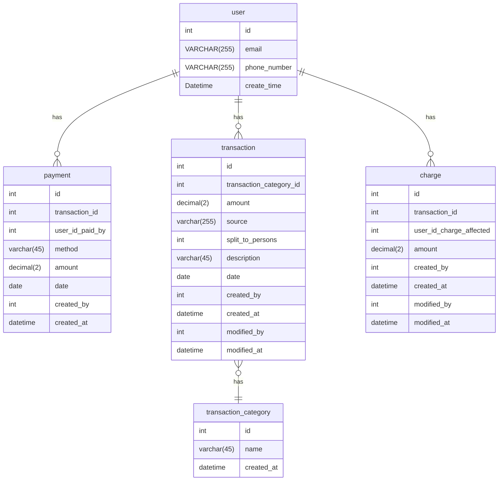
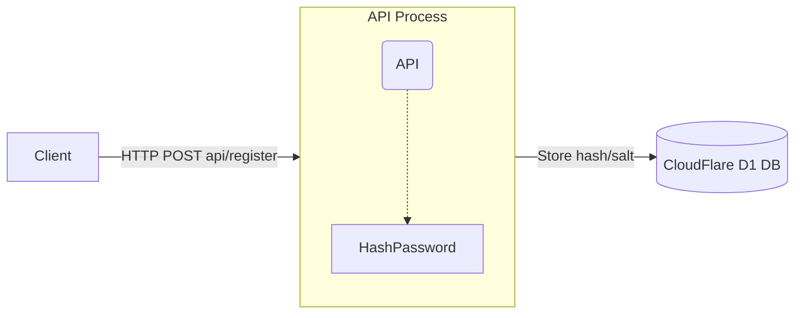
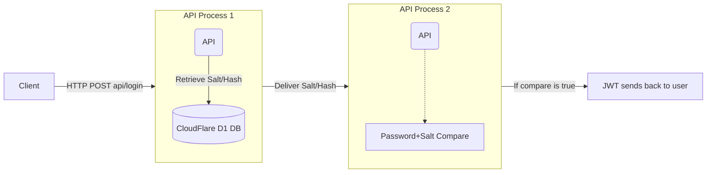

# Architecture Details
Purpose: Outline visually and through text how the application can be interacted with as well as its functionality.

## SQL Database ERD
The following is an ERD generated through mermaid.

## Password Storing Process

The following is a flowchart diagram generated in mermaid

## Password Auth Process

The following is a flowchart diagram generated in mermaid
